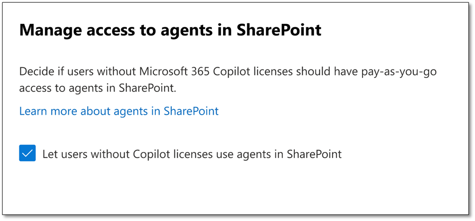

# Get started with SharePoint agents

[SharePoint agents](https://support.microsoft.com/office/get-started-with-agents-in-sharepoint-69e2faf9-2c1e-4baa-8305-23e625021bcf), powered by AI, help users quickly find information and insights on SharePoint sites, pages, and document libraries. These agents access your organization's data the same way [Copilot in other Microsoft 365 apps](/sharepoint/sharepoint-copilot-best-practices#copilot-and-sharepoint) does, responding to users based on their access permissions to the data. This article discusses how admins can get started with SharePoint agents, including setting up pay-as-you-go billing and managing Azure resources for agents.

## Understand who can set up and use an agent

**Set up an agent**: Anyone who can use SharePoint and can add new files to a site can set up an agent. 
**Use an agent**: Using an agent requires either an assigned Copilot license or your organization to have pay-as-you-go billing set up for SharePoint agents.

> [!IMPORTANT]
> If your organization hasn’t adopted Microsoft 365 Copilot, it’s recommended to review the requirements and learn how to adopt it for your organization. [Learn more](/copilot/microsoft-365/microsoft-365-copilot-overview).  

## Use agents with Copilot licenses

Users can use SharePoint agents after being [assigned a Copilot license](/copilot/microsoft-365/microsoft-365-copilot-enable-users#assign-licenses). You can use the [Microsoft 365 Copilot setup guide](https://admin.microsoft.com/Adminportal/Home?Q=learndocs#/modernonboarding/microsoft365copilotsetupguide) in the Microsoft 365 admin center to assign the required licenses to users. For more information, see [Assign licenses to users in the Microsoft 365 admin center](/microsoft-365/admin/manage/assign-licenses-to-users) and [Microsoft 365 Copilot requirements](/copilot/microsoft-365/microsoft-365-copilot-requirements). See more about [controlling user access through licensing](/sharepoint/manage-access-agents-in-sharepoint#control-user-access-through-licensing).

## Use agents with pay-as-you-go billing

### Set up SharePoint agents as an Azure resource

To use pay-as-you-go billing, you need to first set up SharePoint agents  as a resource in Azure. That resource is used whenever a user without a Microsoft 365 Copilot license uses a SharePoint agent.

#### Prerequisites to set up SharePoint agents as a resource in Azure

- Have at least a SharePoint administrator role
- Have Owner or Contributor Azure roles to a pay-as-you-go Azure subscription
- Have Owner or Contributor Azure roles to an Azure resource group linked to the same Azure subscription

> [!NOTE]
> - The Owner or Contributor Azure roles are only needed in the time windows where you set up billing.
> -	To grant an owner or Contributor Azure role, follow the instructions [here](/azure/role-based-access-control/role-assignments-portal). 

To set up SharePoint agents as an Azure resource:

1. If you haven’t, [create an Azure subscription](https://azure.microsoft.com/pricing/offers/ms-azr-0003p/) with the pay-as-you-go offer. 
1. [Create an Azure resource group](/azure/azure-resource-manager/management/manage-resource-groups-portal#create-resource-groups) for SharePoint agents.

### Set up pay-as-you-go billing for SharePoint agents

After setting up an Azure resource group for SharePoint agents, you can set up pay-as-you-go billing for SharePoint agents in the Microsoft 365 admin center. Here's how:

1. Go to the Microsoft 365 admin center, Org settings, and then pay-as-you-go services (formerly Microsoft Syntex).
1. Under Billing, select agents in SharePoint.
1. Select the Azure subscription and resource group that you want to use. Then select the region where you want the agents in SharePoint resource to be created.
1. Accept the pay-as-you-go billing terms of service.
1. Select Save.

### Let users without Copilot licenses use agents in SharePoint

If you just finished setting up billing, select **Let users have access to agents in SharePoint**.

Otherwise, go to **Microsoft 365 admin center** > **Org settings** > **pay-as-you-go services** (formerly Microsoft Syntex).

1.	Under Settings, select **agents in SharePoint**.
1.	Select **Let users without Copilot licenses use agents in SharePoint**.
1.	Select **Save**.

### Monitor consumption in Azure Cost Management

To monitor your organization’s consumption of agents with the pay-as-you-go, you can create a budget in Azure Cost Management with [Bicep](/azure/cost-management-billing/costs/quick-create-budget-bicep) and [ARM template](/azure/cost-management-billing/costs/quick-create-budget-template). Budget helps you inform others about their spending to proactively manage costs and monitor how spending progresses over time. You can also set up various types of cost alerts to monitor the consumption. 
Furthermore, you can view your organization’s consumption by:

1.	Going to [Azure Cost Management](https://portal.azure.com/#view/Microsoft_Azure_CostManagement/Menu/~/overview/openedBy/AzurePortal)
1.	If needed, change the scope to select the subscription that is being used for agents in SharePoint.

### Adjusting consumption

Using pay-as-you-go billing means that each user is responsible for their own consumption. Work with people in your organization to ensure the efficient use of agents in SharePoint. For example, restrict access to SharePoint sites with agents to only those who need to use them.

### Paying your invoice

Your organization receives an invoice for all Azure services used at the end of each month. You can pay these invoices under the Invoices section in the subscription that you use for agents in SharePoint.

